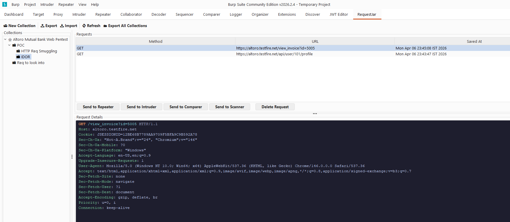
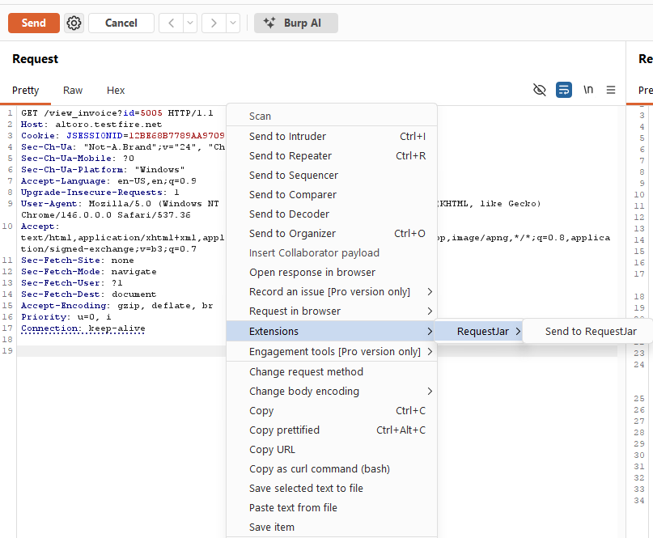

# RequestJar - Burp Suite Extension

> **Save, organize, and replay HTTP requests during penetration testing. Your work is saved persistently across sessions, even in Burp Community!**

[](https://github.com/sahilvinodMhatre/RequestJar/releases/download/RequestJar-V2.0.0/RequestJar-2.0.0.jar)

---



## ✨ Features

| Feature | Description |
|---|---|
| 🕸️ **Collections** | Top-level collections (one per target) with unlimited subfolders |
| 💾 **Save Requests** | Right-click any request in any Burp tab → Send to RequestJar |
| 📁 **Folder Creation** | Create collections & subfolders directly from the save dialog |
| ✏️ **Rename** | Rename any collection or subfolder from the right-click context menu |
| 📋 **Move / Copy** | Move or copy requests between folders and collections |
| 📨 **Response Capture** | Automatically saves the HTTP response when available (Repeater, HTTP History, etc.) |
| 🎨 **Syntax Highlighting** | Request & response displayed with colour-coded HTTP syntax (status codes colour-coded by range) |
| 📤 **Export** | Export one collection or all collections to JSON (full hierarchy including responses) |
| 📥 **Import** | Import a previously exported JSON file to restore full folder structure |
| 🔁 **Burp Integration** | Send stored requests to **Repeater**, **Intruder**, **Comparer**, or **Scanner** |
| 🛡️ **Session Persistence** | Data is stored in a local SQLite database (`~/.requestjar/`), so you never lose your work when Burp is closed (ideal for Community Edition users) |
| 🗄️ **Local SQLite DB** | All data stays local — no external connections |
| 🔒 **Secure by Design** | Parameterized queries, input validation, thread-safe DB access, bounded imports |


---

## 🚀 Installation (Recommended — Pre-built JAR)

No build tools required.

1. Go to the [**Releases**](../../releases) page and download **`RequestJar-2.0.0.jar`**.
2. Open **Burp Suite**.
3. Navigate to **Extensions** → **Installed** → **Add**.
4. Set **Extension type** to `Java`.
5. Click **Select file** and choose the downloaded `RequestJar-2.0.0.jar`.
6. Click **Next** — the **RequestJar** tab will appear in Burp's tab bar.

> **Note:** The JAR is self-contained (all dependencies bundled). No separate installation steps needed.

---

## 📖 Usage

### Saving a Request

1. In any Burp tab (Proxy, Repeater, etc.), **right-click** a request.
2. Select **Send to RequestJar**.
3. In the dialog that opens:
   - Select an existing collection or subfolder, **or**
   - Click **📂 New Collection** to create a new one, **or**
   - Select a collection and click **📁 New Subfolder** to add a subfolder inside it.
4. Click **💾 Save Here**.

> **Note:** If the request has an associated response (e.g., from Repeater or HTTP History), the response is saved automatically.



### Managing Collections

| Action | How |
|---|---|
| New collection | Toolbar → **📂 New Collection** |
| New subfolder | Right-click a collection in the tree → **📁 New Subfolder** |
| Rename | Right-click → **✏️ Rename** |
| Delete | Right-click → **🗑 Delete** (cascades to all subfolders & requests) |
| Refresh | Toolbar → **🔄 Refresh** |

### Sending Requests to Burp Tools

1. Select a folder in the left panel to load its requests.
2. Click a request in the table to select it.
3. Use the buttons below the table (or right-click):
   - **Send to Repeater** — opens in Repeater with correct host/port/HTTPS
   - **Send to Intruder** — loads for fuzzing
   - **Send to Comparer** — side-by-side diff
   - **Send to Scanner** — active scan *(Burp Pro only)*

### Export & Import

**Export selected collection:**
- Select a collection in the left panel → Toolbar → **📤 Export**

**Export all collections:**
- Toolbar → **🗂 Export All Collections**

**Import:**
- Toolbar → **📥 Import** → choose a previously exported `.json` file
- The full folder hierarchy, all requests, and their responses are restored

---

## 🗂 Project Structure

```
Request-Jar/
├── pom.xml
└── src/main/java/com/requestjar/
    ├── RequestJarExtension.java        # Entry point, context menu, shutdown hook
    ├── database/
    │   ├── DatabaseManager.java        # Thread-safe SQLite CRUD + schema migration
    │   ├── Request.java                # Request model (incl. host/port/protocol/response)
    │   └── Folder.java                 # Folder model
    ├── gui/
    │   ├── RequestJarTab.java          # Main UI tab, collection tree, rename
    │   ├── RequestViewerPanel.java     # Request table + tabbed request/response viewer + move/copy
    │   ├── FolderSelectionDialog.java  # Reusable folder picker (save, move, copy)
    │   ├── ExportDialog.java           # JSON export (full hierarchy + responses)
    │   └── ImportDialog.java           # JSON import with security limits
    └── utils/
        └── BurpIntegration.java        # Repeater / Intruder / Comparer / Scanner API
```

---


## 🤝 Contributing

Feel free to contribute to this open-source project. Make sure to follow security best practices and coding standards. 

---

## 🔨 Building from Source

Only needed if you want to contribute or modify the extension.

### Prerequisites
- Java 15+
- Maven 3.6+
- Burp Suite JAR (for the API — provided as `scope: provided`)

### Steps

```bash
# 1. Clone
git clone https://github.com/sahilvinodMhatre/RequestJar.git
cd Request-Jar

# 2. Install the Burp extender API to local Maven repo
#    (replace the path with your actual Burp Suite JAR location)
mvn install:install-file \
  -Dfile="C:/Program Files/BurpSuitePro/burpsuite_community.jar" \
  -DgroupId=net.burp-extender-api \
  -DartifactId=burp-extender-api \
  -Dversion=2026 \
  -Dpackaging=jar

# 3. Build
mvn clean package

# Output: target/RequestJar-X.0.0.jar
```

---

## 📄 License

This project is licensed under the **GNU General Public License v3.0**. See the [LICENSE](LICENSE) file for the full text.
